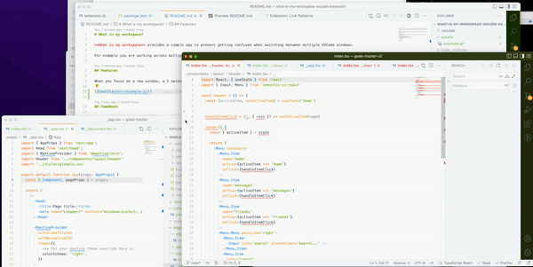

# What is my workspace?

**What is my workspace** provides a simple way to prevent getting confused when switching between multiple VSCode windows.

For example you are working across multiple repositories and didn't realise you were modifying the wrong config file for the wrong project.

## Features

When you focus on a new window, a 1 second 'popup' will open forcing you to see in large text which workspace you are currently on.

## Feedback

Please send feedback or contribute if any issues. Due to the limitations of VSCode a custom dialogue box could not be used to display the workspace title.

Further improvements could include:

- a different color for each window session
- ability to disable/enable this extension using commands
- custom closing time

## Release Notes

### 1.0.0

Initial release
